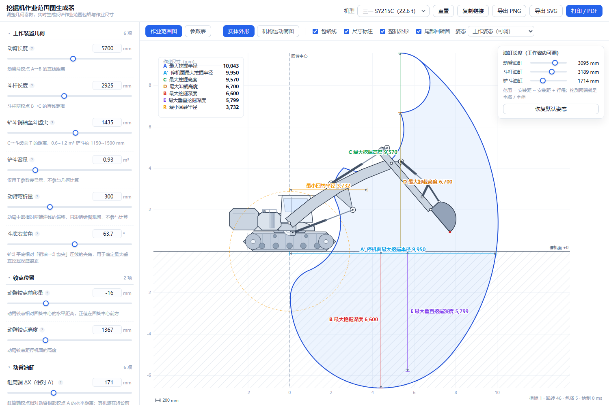
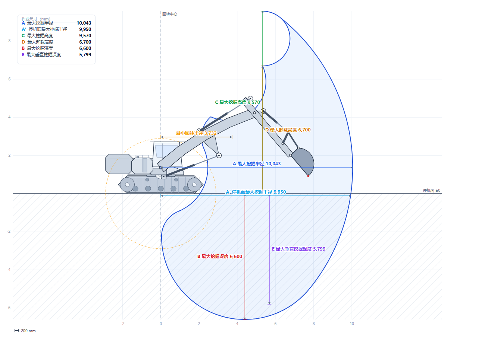
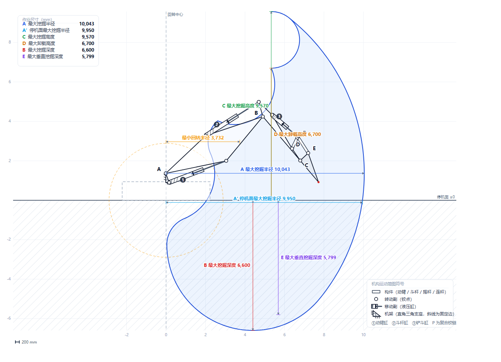

# 挖掘机作业范围图生成器

> 调几何参数 → 实时生成反铲液压挖掘机作业范围包络图与作业尺寸。
> **纯静态 · 零依赖 · 零构建 · 零后端**：所有计算都在浏览器里完成，服务端不存任何数据。

[文档索引](#文档) ·
[快速开始](#快速开始) ·
[English summary](#english-summary)

> 演示站点已在自有云主机上线（阿里云 ECS + nginx），**地址不随本仓库公开**；需要试用或看线上效果请联系作者。



---

## 这是什么

一个给挖掘机从业者（设计、销售、租赁、维修）用的**作业范围图在线生成器**。左边调参数，右边实时出图：

- **参数是几何量**：动臂多长、斗杆多长、油缸装在哪、安装距多大、行程多少 —— 而不是「最大挖掘半径是多少」；
- **指标是算出来的**：关节角范围由三个油缸的「安装位置 + 安装距 + 行程」经连杆机构反解得到，单一数据来源；
- **图面按真机画**：履带轮系、配重机罩、驾驶室、弯动臂、切半圆斗形，以及 GB/T 4460 的机构运动简图符号；
- **数据能被核对**：附参数表（含铰点坐标对照、油缸布置自检），并可与厂家样本逐项对标。

标定基准是**某 20 吨级挖掘机**——动臂 5700 / 斗杆 2925 / 斗容 0.93 m³，公开样本六项标称值全部复现，偏差 < 0.1%：

| 指标 | 样本标称 | 本工具计算 |
|---|---|---|
| 停机面最大挖掘半径 | 9950 | **9950** |
| 最大挖掘深度 | 6600 | **6600** |
| 最大挖掘高度 | 9570 | **9570** |
| 最大卸载高度 | 6700 | **6700** |
| 最大垂直挖掘深度 | 5800 | **5799** |
| 最小回转半径 | 3730 | **3732** |

### 两种图面

| 实体外形（真机侧视） | 机构运动简图（GB/T 4460 符号） |
|---|---|
|  |  |

---

## 特性

| 功能 | 说明 |
|---|---|
| 40 项参数 | 6 组：工作装置几何 / 铰点位置 / 动臂油缸 / 斗杆油缸 / 铲斗油缸与四连杆 / 整机外形。参数元数据只写在 `params.js` 一处，面板、参数表、分享链接全部自动跟着变 |
| 油缸反解关节角 | 关节角**不是输入项**。三根油缸各由「缸筒端 + 活塞杆端 + 安装距 + 行程」定出关节角范围，避免「油缸说一套、角度说另一套」 |
| 标准四连杆铲斗 | 斗杆–摇杆–连杆–铲斗：摇杆与连杆都是两铰点杆，与铲斗油缸活塞杆共用一个销轴 P |
| 六项作业尺寸 | 全部按国标姿态定义实现（不是取包络极值），并在图上按对应姿态标注 |
| 八段圆弧包络 | 作业范围包络按作图法逐段生成，与厂家样本图叠合验证过 |
| 最小回转半径 | 用「支撑函数 + 换顶点角」求精确极小值，不靠采样，改斗形也不会因采样错过谷底而算错 |
| 两种图面 | 实体外形（真机侧视）/ 机构运动简图（转动副画圆圈、移动副画油缸、构件画杆件） |
| 工作姿态可调 | 直接拖三根油缸的长度（量程 = 安装距 ~ 安装距+行程），姿态随时可存进分享链接 |
| 手机可用 | 竖屏打开**首屏就能看到作业范围图**（图独占一块自适应高度的画布，与顶栏/工具栏高度解耦）；图面支持双指捏合缩放、放大后单指平移、双击复位，右下角也有 ＋/−/复位 按钮；工具栏在窄屏改为单行横向滚动，姿态面板移到图下方不再遮挡 |
| 参数表 | 作业尺寸 / 几何参数 / 铰点坐标对照 / 油缸布置自检 / 计算口径说明，可直接打印 |
| 分享与导出 | 分享链接（短键，只写与预设不同的字段）、导出 PNG（高分辨率）、导出 SVG（矢量）、打印 / 另存 PDF |
| 零依赖 | 没有 `node_modules`，没有打包器，没有后端。`git clone` 之后一个 `node tools/serve.mjs` 就能跑 |

---

## 快速开始

```bash
git clone <this-repo> && cd excavator-working-range

# 起一个本地静态服务（零依赖，只用 node:http）
node tools/serve.mjs              # → http://127.0.0.1:8080
node tools/serve.mjs --port 5000  # 换端口
node tools/serve.mjs --host 0.0.0.0   # 局域网内其它设备访问

# 跑测试（146 项）
node tools/test.mjs
```

> ⚠️ **不要直接双击 `index.html`**：页面用的是原生 ES 模块，`file://` 协议下浏览器会以 CORS 为由拒绝加载模块，必须走 HTTP 服务。

---

## 项目结构

```
index.html                入口（空壳 + 一条 <script type="module">）
assets/core/              计算内核 —— 零 DOM，可在 Node 里直接单测
  geometry.js             平面连杆运动学、外形轮廓、斗形作图法
  cylinders.js            三根油缸的正解/反解、铲斗四连杆、装配支、油缸布置自检
  params.js               参数规范（40 项）、范围收敛、合法性校验、派生量
  metrics.js              六项作业尺寸 + 各自的标准姿态
  envelope.js             八段圆弧包络 + 最小回转半径（精确解）
  presets.js              机型预设（某 20 吨级挖掘机的标定数据；油缸与连杆为可替换示例值）
  share.js                分享链接编解码（短键 + 只写差异字段）
assets/ui/                浏览器界面层（DOM / SVG）
  draw.js                 作业范围图渲染（实体外形、尺寸标注、指标卡、比例尺）
  schematic.js            机构运动简图符号（GB/T 4460）
  chart-table.js          参数表与打印页眉
  controls.js             参数面板（由 PARAM_SPEC 自动生成，滑块 ↔ 数字框联动）
  exporter.js             PNG / SVG / 剪贴板导出
  app.js                  状态、交互、合帧渲染、URL 同步
  zoom.js                 图面缩放/平移（双指捏合、滚轮、双击；纯数学部分可在 Node 单测）
assets/style.css          样式（含 @media print 打印排版与窄屏适配）
tests/                    146 项 node 测试（10 个文件）
tools/                    本地服务、测试入口、标定与反解工具
deploy/                   阿里云 ECS + nginx 部署手册与打包脚本
.verify/selftest.html     浏览器端自检页（80+ 项检查，随代码入库维护）
docs/                     技术文档（见下）
```

**依赖方向是单向的**：`core` 不依赖 `ui`，`ui` 单向依赖 `core`。所以计算内核可以脱离浏览器单独测试与复用（这也是它能被搬进命令行、桌面端甚至小程序的前提）。

---

## 计算模型一页纸

```
A  动臂根部铰点        B  动臂–斗杆铰点        C  斗杆–铲斗铰点        T  斗齿尖
α  动臂仰角(绝对)      Δ  斗杆相对转角         ψ  铲斗相对转角

B = A + L1·u(α)        C = B + L2·u(α+Δ)      T = C + R3·u(α+Δ+ψ)      u(t) = (cos t, sin t)

关节角范围 ← 三根油缸：安装位置 + 安装距 + 行程  → 反解（扫单调区段 + 二分求根）
作业范围包络 ← 八段圆弧作图法：每段只让一个关节走完全程，其余保持不动
六项作业尺寸 ← 各自的标准姿态（不是取包络极值），姿态与指标严格对应
最小回转半径 ← 斗体轮廓的支撑函数在可达朝向区间上的精确极小值
铲斗外形 ← 「切掉一部分的半圆」：直边端点为齿尖 T，切除线与直边交点为铰点 C，
           切除线另一端为连杆铰点 E —— 形状完全由 bktEAlong / bktEPerp / bucketRadius 推出
```

细节见 **[docs/模型与算法.md](docs/模型与算法.md)**。

---

## 参数口径

这个项目最容易踩坑的地方是**参数的坐标基准**：同一个「铰点位置」，从 A 量、从 B 量、从 C 量，正负号完全不同。约定如下（与真机图纸口径一致）：

| 参数组 | 基准 |
|---|---|
| 动臂油缸缸筒端 | 相对动臂根部铰点 **A** 的 (ΔX, ΔY)：ΔX>0 在 A 前方，ΔY<0 在 A 下方 |
| 斗杆油缸缸筒端 | 自动臂末端销孔 **B** 起算（沿动臂向根部为负、垂直动臂向上为正）→ 改动臂长度时它跟着 B 走 |
| 斗杆油缸活塞杆端 | 斗杆坐标系（原点 **B**，+x 指向 C）：真机在 B 点后方、斗杆上表面 |
| 铲斗油缸缸筒端、摇杆铰点 D | 自斗杆末端销孔 **C** 起算（向根部为负、上方为正）→ 改斗杆长度时它俩跟着 C 走 |
| 连杆–铲斗铰点 E | 铲斗坐标系（原点 **C**，+x 指向斗齿尖） |

完整 40 项参数表、自检项与常见坑见 **[docs/参数口径.md](docs/参数口径.md)**。

---

## 测试与自检

```bash
node tools/test.mjs        # 146 项 node 测试（计算内核 + 渲染字符串 + 参数表 + 分享 + 窄屏适配 + 缩放）
```

- **为什么不用 `node --test tests/`**：在受限沙箱里 `node --test` 会为每个测试文件 spawn 子进程并走管道收集输出，沙箱禁止命名管道会直接 `EPERM` 失败。`tools/test.mjs` 把 8 个测试文件 import 进同一个进程，绕开这个问题，也让 `npm test` 保持一条命令。
- **浏览器端自检**：打开 `.verify/selftest.html`（80+ 项检查，含渲染/导出/布局/数值），用于验证 node 里测不到的那一层。
- **标定工具**：`tools/calibrate.mjs`（对样本指标）、`tools/fit-preset.mjs`（反解机型几何）、`tools/setup-cylinders.mjs`（按标定角反算油缸安装距/行程）。

细节见 **[docs/开发与测试.md](docs/开发与测试.md)**。

---

## 常见问题

**Q：为什么把「连杆–铲斗铰点 垂直斗齿」从 553 往下调，到 536 以下就报红字？**
不是界面限制。铲斗转角只能由铲斗油缸的「安装距 + 行程」反解，且要求在 ψ 轴上存在一条**单调行程段**完整覆盖整段行程（默认 1343.7 ~ 2531.3 mm）。E 往下移会让四连杆在同样行程下能推到的极限缸长变小：536 mm 时是 2531.4 mm（刚好够），535 mm 时只剩 2530.8 mm（差 0.5 mm）→「全伸 = 卸料位」这个端点解不出来，于是自检报「铲斗相对转角无法由油缸行程解出」。想再往下调，动**任意一项**即可：安装距 −20 mm、行程 −20 mm，或摇杆 +20 mm。

**Q：为什么直接双击 `index.html` 是白屏？**
浏览器对 `file://` 下的 ES 模块有 CORS 限制。用 `node tools/serve.mjs`。

**Q：改了「履带长度 / 驾驶室高度 / 动臂截面宽」这些参数，为什么作业尺寸没变？**
它们只影响绘图外观与最小回转半径，不参与运动学计算——参数面板里已经标了分组提示。

**Q：手机上看得清吗？标注会不会太密？**
手机上整幅存在的问题是「看得见但看不清」——这是一张标注密集的工程图（铰点、油缸、支座、六条尺寸线）。
现在的做法是：图的画布高度按可视高度自适应（竖屏约 `100dvh − 165px`），图形比原来大 15~20%，
并且**双指捏合可以放大**（SVG 矢量，放大不糊），放大后单指拖动平移，双击或右下角 ⤢ 复位。
需要逐项核对数值时，切到「参数表」页签看表格，比在图上认标注更省事。

**Q：参数会被上传吗？图纸数据安全吗？**
不会。所有计算在浏览器本地完成，页面不发任何请求；分享链接是**把参数编码在 URL 里**，服务端不存数据（部署的也只是一堆静态文件）。

**Q：能改成命令行 / 桌面端 / 小程序吗？**
可以。`assets/core/*` 是零 DOM 的纯函数模块，换掉 `assets/ui/` 这一层即可复用全部计算与测试。

---

## 文档

| 文档 | 内容 |
|---|---|
| [docs/模型与算法.md](docs/模型与算法.md) | 坐标系与符号、油缸反解、四连杆、八段圆弧包络作图法、六项指标定义、最小回转半径精确解、斗形作图法 |
| [docs/参数口径.md](docs/参数口径.md) | 40 项参数表（自动生成）、三套坐标基准、自检清单、常见坑 |
| [docs/开发与测试.md](docs/开发与测试.md) | 目录职责、如何加参数/加机型、测试体系与自检页、性能基线、提交约定 |
| [docs/部署与运维.md](docs/部署与运维.md) | 上线流程、服务器信息、回滚、缓存与配置漂移注意事项 |
| [deploy/README.md](deploy/README.md) | 部署手册（打包 → 上传 → 解包替换 → 外部逐文件校验） |
| [CHANGELOG.md](CHANGELOG.md) | 变更记录 |

---

## 贡献

欢迎提 Issue 反馈机型数据或算法问题。提交 PR 前请保证 `node tools/test.mjs` 全绿（146 项）；改动计算内核时请说明**为什么**——这个项目的注释与文档都以「记录取舍理由」为目标。
改动手机端 / 响应式相关代码时，除 node 测试外请再跑一次 `.verify/measure-mobile.mjs`（手机视口实测）与 `.verify/measure-print.mjs`（打印回归）。

---

## 许可

**本仓库暂未添加开源许可证，默认保留所有权利**：代码公开可见，但未授权他人复制、修改、分发或商用。
需要授权（或希望改用 MIT / Apache-2.0 等许可证）请联系作者。
线上演示站点同样不构成任何形式的授权或担保。

---

## English summary

A zero-dependency, build-free, backend-free web tool that draws the **working-range envelope** of a hydraulic backhoe excavator and computes its six standard working dimensions (max digging radius / ground-level digging radius / max digging height / dump height / max digging depth / max vertical wall depth) plus the minimum swing radius.

Inputs are **geometry** (boom / arm / bucket dimensions, pivot positions, cylinder mounts, installation lengths and strokes) — joint angles are *derived* by inverting the linkage, so there is a single source of truth. The envelope is drawn with the classic eight-arc construction method; the bucket is stylised as a semicircle with a wedge cut off, whose straight-edge end is the tooth tip, whose cut-edge/straight-edge intersection is the stick-to-bucket pivot, and whose other cut point is the linkage pivot. Calibrated against the published datasheet of a 20-tonne-class excavator (all six nominal values reproduced within 0.1%).

Run it with `node tools/serve.mjs`, test it with `node tools/test.mjs`.
