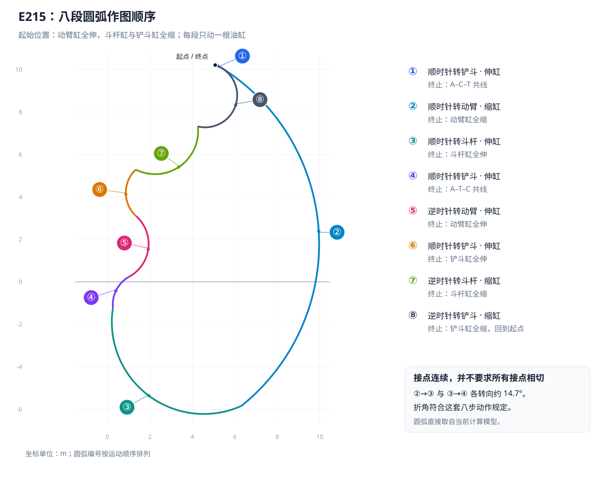

# 八段圆弧包络验证

> 验证基线：`2ecf455`，2026-10-05。机型：`x20t` 与 `E215HC4488A06A0`。
> 本文核对指定八步单缸运动，未改变包络轨迹或对接点增加平滑曲线。

## 1. 作图规定

A 为动臂根部铰点，B 为动臂–斗杆铰点，C 为斗杆末端铰点，T 为斗齿尖。逆时针为角度正方向。起始为动臂油缸全伸、斗杆油缸和铲斗油缸全缩。

| 段 | 动作 | 终止条件 | 保持缸长不变 |
|---|---|---|---|
| ① | 顺时针转铲斗，伸出铲斗缸 | A–C–T 共线，齿尖在 C 外侧 | 动臂、斗杆 |
| ② | 顺时针转动臂，收回动臂缸 | 动臂缸全缩 | 斗杆、铲斗 |
| ③ | 顺时针转斗杆，伸出斗杆缸 | 斗杆缸全伸 | 动臂、铲斗 |
| ④ | 顺时针转铲斗，伸出铲斗缸 | A–T–C 共线，齿尖在 A 与 C 之间 | 动臂、斗杆 |
| ⑤ | 逆时针转动臂，伸出动臂缸 | 动臂缸全伸 | 斗杆、铲斗 |
| ⑥ | 顺时针转铲斗，伸出铲斗缸 | 铲斗缸全伸 | 动臂、斗杆 |
| ⑦ | 逆时针转斗杆，收回斗杆缸 | 斗杆缸全缩 | 动臂、铲斗 |
| ⑧ | 逆时针转铲斗，收回铲斗缸 | 铲斗缸全缩，返回起点 | 动臂、斗杆 |



## 2. E215 数值核验

缸长单位为 mm，下表保留一位小数。三个油缸的完整行程分别为：动臂 1790～3025、斗杆 2110～3650、铲斗 1655～2720。

| 状态 | 动臂缸 | 斗杆缸 | 铲斗缸 | 结果 |
|---|---:|---:|---:|---|
| 起始 | 3025.0 | 2110.0 | 1655.0 | 全伸 / 全缩 / 全缩 |
| ①末 | 3025.0 | 2110.0 | 1730.5 | A–C–T 共线 |
| ②末 | 1790.0 | 2110.0 | 1730.5 | 动臂全缩 |
| ③末 | 1790.0 | 3650.0 | 1730.5 | 斗杆全伸 |
| ④末 | 1790.0 | 3650.0 | 2271.5 | A–T–C 共线 |
| ⑤末 | 3025.0 | 3650.0 | 2271.5 | 动臂全伸 |
| ⑥末 | 3025.0 | 3650.0 | 2720.0 | 铲斗全伸 |
| ⑦末 | 3025.0 | 2110.0 | 2720.0 | 斗杆全缩 |
| ⑧末 | 3025.0 | 2110.0 | 1655.0 | 与起始状态一致 |

第①段共线角为 ψ≈22.222192°，第④段共线角为 ψ≈−44.642810°，均在铲斗缸反解的区间 [−138.831804°, 36.318251°] 内。两处均无需截断到行程端点。

## 3. 为什么有折角

只改变动臂角时，齿尖绕 A 作圆弧；只改变斗杆相对角时绕 B 作圆弧；只改变铲斗角时绕 C 作圆弧。八步要求相邻轨迹的位置连续，没有要求相邻圆弧必须相切。

E215 的②→③、③→④接点切线方向各改变约 14.673°。20 吨级示例相同位置只改变约 0.787°，所以其折角视觉上不明显。将采样加密到 0.1°并关闭折线简化后，E215 折角仍然存在，符合指定作图规则。

为消除这两个折角而修改轨迹，会改变规定的运动过程。本版本保持原八步顺序和真实圆弧，不增加视觉平滑段。

## 4. 验证方法与复现

```bash
node tools/verify-envelope-sequence.mjs
node tools/verify-envelope-sequence.mjs --json
```

工具直接读取生产模型的原始点列，采用 0.1°步距、`tol=0`；根据规定动作独立建立期望端点，再从圆心与齿尖坐标反解每个采样点的活动关节角。

逐段检查：

1. 起始三缸长度符合全伸 / 全缩 / 全缩。
2. 圆心固定，所有齿尖采样点的半径保持不变。
3. 活动关节的转向正确，活动油缸按要求单调伸出或缩回。
4. 用世界坐标下油缸两端销轴中心距核对缸长，不动的两根油缸长度保持不变。
5. 全部缸长位于有效行程内，终点达到规定的全缩/全伸值。
6. ①④共线且点序分别为 A–C–T / A–T–C；⑧与起点闭合。

| 机型 | 原始轨迹点数 | 八段检查 | 共线与闭合 |
|---|---:|---|---|
| 20 吨级示例 | 8210 | 全部通过 | 通过 |
| E215 | 8145 | 全部通过 | 通过 |

圆弧半径、固定缸长、共线距离和闭合的数值检查容差为 1e-6 mm。此容差用于核对浮点几何计算，不表示真机测量或制造精度。JSON 结果同时写入本地 `.verify/envelope-sequence-results.json`，该临时结果不入库。

## 5. 与作业尺寸、可达域的关系

八段线是规定运动的闭合轨迹，五项作业尺寸按各自姿态定义单独计算。E215 的最大挖掘深度指标约 6296 mm，八段路径最深约 6222 mm；第③段固定铲斗相对角约 22.222°，与深度指标的 B–C–T 竖直共线姿态不同，因此两者不会必然相等。

该验证只证明两种当前预设符合八步规定，不证明填充区域内每一点都可达，也不证明五项尺寸是全部可达姿态的全局极值。其他参数若使①④需要的共线角超出铲斗行程，生产算法会截断到端点，而严格的八步验证会报错。
