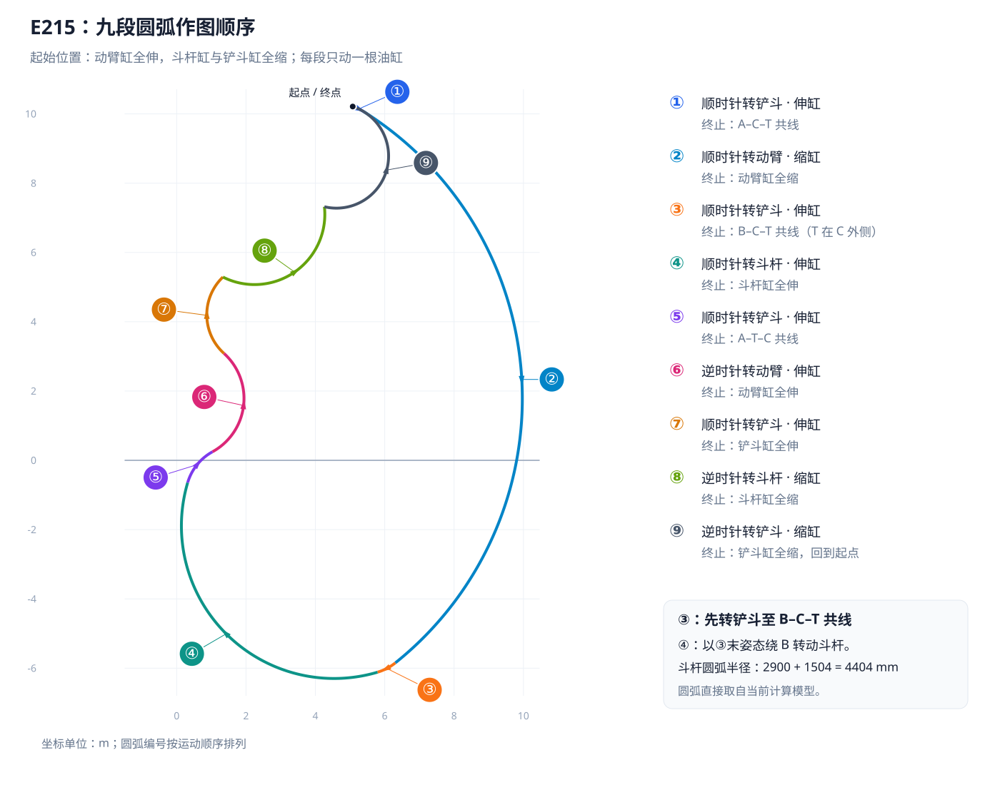
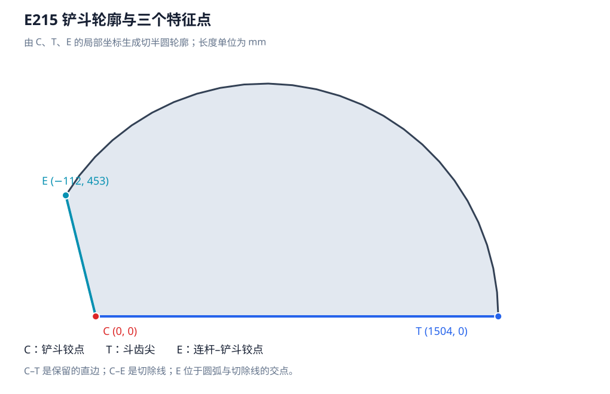

# 模型与算法

> 本文说明「输入几何参数之后，图上的每一条线、每一个数字是怎么算出来的」。
> 对应代码：`assets/core/geometry.js`、`cylinders.js`、`metrics.js`、`envelope.js`、`forces.js`。
> 当前验证版本：2026-10-06 九段包络修复（入口及包络模块资源戳 `20261006b`）。示例图采用 E215 尺寸资料；标称值标定使用 20 吨级示例机型。

---

## 1. 坐标系与符号

世界坐标系（单位 mm，角度为「度」）：

- 原点 **O** = 回转中心在停机面上的投影
- **x 轴**水平向前（挖掘侧）为正，**y 轴**竖直向上为正，`y = 0` 即停机面
- 角度**逆时针为正**，0° 指向 +x

| 符号 | 含义 |
|---|---|
| **A** | 动臂根部铰点 = `(pivotX, pivotY)` |
| **B** | 动臂–斗杆铰点 |
| **C** | 斗杆–铲斗铰点 |
| **T** | 斗齿尖 |
| **α** | 动臂仰角（绝对角，相对 +x 轴） |
| **Δ** | 斗杆相对转角（相对动臂）。0° = 与动臂共线前伸；**负值 = 斗杆往机身内收**，这才是反铲的作业方向 |
| **ψ** | 铲斗相对转角（相对斗杆），斗齿尖绕 C 转动 |

内部三角函数一律用弧度，对外接口（参数、指标、测试断言）一律用度——`geometry.js` 里的 `toRad / toDeg / DEG / RAD` 是唯一转换点。

---

## 2. 正运动学

三连杆串联，给定 (α, Δ, ψ) 即可解出四点：

```
u(t) = (cos t, sin t)

A = (pivotX, pivotY)
B = A + boomLength · u(α)
C = B + armLength  · u(α + Δ)
T = C + bucketRadius · u(α + Δ + ψ)
```

`solvePose()` 是纯函数：无副作用、无缓存、与油缸无关。**整条链路里只有这一处定义 A/B/C/T**，其它模块（绘图、指标、包络、参数表）都从这里取点。

---

## 3. 关节角不是输入项：由三根油缸反解

这是本项目最重要的设计决定。界面上调的是「油缸缸筒端装在哪、活塞杆端装在哪、安装距多少、行程多少」，关节角范围是**解出来的派生量**（`cylinders.js` → `resolveJointRanges()`）。好处是永远不会出现「油缸说一套、角度说另一套」。

### 3.1 动臂油缸 → α（解析反解）

缸筒端固定在转台上：`A + (boomCylBodyDX, boomCylBodyDY)`；活塞杆端在动臂坐标系里 `(boomCylRodAlong, boomCylRodPerp)`。设 d = |A→缸筒端|、r = |活塞杆端|，由余弦定理：

```
cos θ = (d² + r² − L²) / (2·d·r)
α = atan2(ΔY, ΔX) − atan2(perp, along) + acos(θ)
```

油缸长度随仰角单调递增，取唯一分支即可（`boomAngleFromLength`）。

### 3.2 斗杆油缸 → Δ（先定「装配支」，再反解）

同一条缸长下余弦定理给出**两个**解——对应「活塞杆端落在某条连线两侧」的两种装配姿态。这个项目把「支」视为**整台机器的装配方案**，一次定死、全程沿用：

1. **用户口径优先**：真机斗杆油缸装在动臂上表面，活塞杆端铰点**全程高于动臂两端点连线 A–B**。整条行程都在上方的那个支才是真机支（`armRodPerpSpan`）。
2. 两支都在上方 / 都不在上方时，退回**设计支判据**：`dL/dΔ` 的符号应与安装几何自带的符号一致（`designBranch`）。

> ⚠️ 为什么不能「每个缸长各自挑一个解」：判据一旦在行程中途翻面，图上的斗杆会整支跳过去——实测约 5% 的参数组会跳几十度到三百多度。定支之后 `L → Δ` 才是连续单调的。

### 3.3 铲斗油缸 + 四连杆 → ψ（扫单调区段 + 二分）

铲斗没有「油缸直连」，而是标准的「斗杆–摇杆–连杆–铲斗」四连杆：

```
D = 摇杆在斗杆上的铰点（自 C 向根部为负、斗杆上平面）
P = D + 摇杆长度（方向待定）       ← 与铲斗油缸活塞杆端、连杆端共用这一个销轴
E = 连杆–铲斗铰点（铲斗坐标系，随 ψ 绕 C 转动，|PE| = 连杆长度）
```

给定 ψ：E 定出 → P 是「以 D 为圆心、摇杆长为半径」与「以 E 为圆心、连杆长为半径」的两个圆交点（`solveRockerJoint`，`bktBranch` 决定取哪一支）→ 缸长 `L = |P5 − P|`（P5 = 铲斗油缸缸筒端）。

反解（`bucketPsiFromLength`）不走解析式，而是：

1. 在 ψ ∈ [−195°, 195°] 上按 1.5° 扫描缸长，切出**可装配且严格单调**的区段（缸长跳跃/不可装配处断开）；
2. 要求存在**一条**区段，其缸长范围**完整覆盖整段行程** `[安装距, 安装距 + 行程]`；
3. 在这条区段内二分求根，得到 ψ。

第 2 条就是这个项目里最容易被误解的硬门槛（详见 [参数口径](参数口径.md) 的「三个最常见的坑」一节）：把 E 往下调会让四连杆在同样行程下能推到的极限缸长变小，一旦盖不住「全伸」端，ψ 区间就解不出来，界面直接报红字。

---

## 4. 作业范围包络：九段圆弧作图法

包络按指定作图法逐段生成：起始为动臂缸全伸、斗杆缸和铲斗缸全缩；每段只动一个关节，到该段规定的终点，其余两根油缸保持原长。动臂全缩之后，先顺时针转铲斗至 B–C–T 共线，再以该姿态转斗杆。原八段漏掉了这个对齐动作，斗杆扫描半径偏小；新增段为③，原③～⑧顺延为④～⑨。

| 段 | 变化量 | 起点 → 终点 | 固定量 |
|---|---|---|---|
| ① | ψ | ψmax → A–C–T 共线 | α=αmax, Δ=Δmax |
| ② | α | αmax → αmin | Δ=Δmax, ψ=psi1 |
| ③ | ψ | psi1 → psiArm（B–C–T 共线） | α=αmin, Δ=Δmax |
| ④ | Δ | Δmax → Δmin | α=αmin, ψ=psiArm |
| ⑤ | ψ | psiArm → psi2（齿尖自外向内扫过） | α=αmin, Δ=Δmin |
| ⑥ | α | αmin → αmax | Δ=Δmin, ψ=psi2 |
| ⑦ | ψ | psi2 → ψmin | α=αmax, Δ=Δmin |
| ⑧ | Δ | Δmin → Δmax | α=αmax, ψ=ψmin |
| ⑨ | ψ | ψmin → ψmax | α=αmax, Δ=Δmax |

- `psi1` = A–C–T 共线时的 ψ，`psi2` = A–T–C 共线时的 ψ；代码将两者夹到铲斗可达区间。B–C–T 同向共线要求 `ψ=0`；`psiArm=clamp(0, ψmin, psi1)`，只在③的顺时针可达范围内追求该目标。目标超出行程时截在可达端点；若①末已经顺时针越过零角，③保持原姿态并保留零长度段。两个当前预设均严格满足①③⑤的共线条件。
- ④固定 `ψ=0` 时，`|BT|=armLength+bucketRadius`，达到给定 B 点下斗杆与齿尖串联的最大长度。E215 的④半径为 4404 mm；旧斗杆圆弧固定 `ψ≈22.222°`，半径只有约 4329.814 mm。
- 单独转动 α、Δ、ψ 时，圆心分别为 A、B、C。当前预设在②→③、③→④、④→⑤接点满足对应共线条件，圆弧的切线同向。原文将漏段位置约 14.673° 的折角解释为合理，现已更正；其它接点仍按真实单缸运动连接，不添加视觉平滑曲线。
- 网页先按默认 0.75° 采样，再用 Douglas–Peucker 简化（默认容差 1 mm）；点数随参数变化，当前 20 吨级 / E215 预设分别为 377 / 386 点。
- 逐段动作、终止缸长及独立验证方法见 [包络验证](包络验证.md)。九段线是规定运动的闭合轨迹；本次补齐低位斗杆扫掠的外侧区域，但没有对任意自定义机构参数求解完整可达域，也不能据填充判断内部每点是否可达。



---

## 5. 五项作业尺寸：按各自的定义姿态计算

指标不是从九段包络上取极值，而是按各自具有工程含义的姿态计算。当前两个预设的数值已与对应姿态核对；修改参数后，还需检查角度与行程提示，不能将超出行程的理想姿态当作可达结果。

| 指标 | 姿态定义 | 计算 |
|---|---|---|
| 最大挖掘半径 A | A–C–T 共线且平行停机面，斗杆取全缩端点 | `pivotX + 有效链长` |
| 停机面最大挖掘半径 A′ | 同一有效链长，且**斗齿尖触地** | `pivotX + √(L² − pivotY²)` |
| 最大挖掘深度 B | 动臂全缩至最低，**B–C–T 三点共线且竖直向下** | `−(y_B − armLength − bucketRadius)` |
| 最大挖掘高度 C | 动臂仰角最大、斗杆全缩、铲斗油缸全缩（开斗端点） | 该姿态下 `T.y` |
| 最大卸载高度 D | 同 C 的姿态，但 **C→T 竖直向下**（齿尖在铰点正下方） | 该姿态下 `T.y` |

数值核验应按对应姿态进行：

- 20 吨级标定示例中，齿尖在这两个高度姿态下接近竖直朝上/朝下，所以 `9570 − 6700 ≈ 2×1435`；这不是所有机型的恒等式。E215 的最大挖掘高度姿态齿尖朝向并非 90°，不能套用该等式。
- `最大挖掘半径 = pivotX + |AC| + bucketRadius`（当前两预设的解析式与姿态解一致）。

> 注意 C 与 D 不能用「y_C ± R3」直接算：全缩端点角由铲斗油缸反解。20t 示例的斗齿朝向接近竖直，其他机型不一定如此；应直接读取该姿态的 `T.y`，保证指标与图上姿态一致。A–C–T 共线也不等于 A–B–C 全部伸直，斗杆端点角仍由行程决定。

E215 的斗杆全缩角为 −33.316°，无法使动臂和斗杆完全伸直；半径指标采用该可达的最直姿态。五项尺寸由各自的姿态定义计算，独立于路径采样。本次补齐③之后，④包含 B–C–T 竖直向下的深度姿态：E215 的解析深度为 6296.193939 mm，0.1°、不简化的九段路径为 6296.193862 mm，默认显示路径为 6295.827394 mm，差异来自采样与简化。旧八段最深约 6222.007 mm 的缺口已修复。最大垂直挖掘深度和仅用于该指标的斗底安装角已移除。

---

## 6. 最小回转半径：铲斗朝向精确求解，动臂/斗杆采样

定义：工作装置收拢到最紧凑姿态时，回转中心到**工作装置最前缘**的水平距离（不含机尾——机尾另有「尾部回转半径」参数）。

关键在「斗体最前缘」。把斗形按 `bucketRadius` 归一化后，斗体在朝向 θ 下的最前缘系数就是它的**支撑函数**：

```
g(θ) = max over 斗形顶点 (lx·cosθ − ly·sinθ)
```

于是某个姿态下的前缘水平距离 = `C.x + bucketRadius · g(θ)`，而 ψ 一变化就是 θ 在扫一个区间。`g(θ)` 是若干正弦函数的逐点最大值，所以区间内的最小值**只可能出现在端点或两条正弦的交点**（「换顶点角」）上——把这些角逐个比一遍就是精确解（`bucketReachMin`），完全不需要对 ψ 采样。

> 这一点很实在：斗形一改（比如把铲斗改成「切掉一部分的半圆」），采样法很容易恰好错过谷底而算错；精确解则与斗形无关。换顶点角只与形状有关，按形状对象缓存（WeakMap）。

上述精确性只针对给定 α、Δ 下的铲斗朝向。`computeMinSwingRadius()` 对 α、Δ 使用默认 25×25 网格，再从每个姿态的最前缘距离中取最小值；因此整机结果仍有这两个角度的采样误差，不是三个自由度的连续全局精确解。

---

## 7. 铲斗外形：切掉一部分的半圆

斗形不是一套独立数据，而是**由三个铰点位置推出来的**（`geometry.js` → `bucketLocalShape`）。局部坐标系：原点 = 铲斗铰点 **C**，+x 指向齿尖 **T**，长度单位 = `bucketRadius`。

作图法（三个特征点全部来自既有参数）：

1. 半圆的**直边（直径）躺在 C→T 这条直线上**，齿尖 **T** 是直边的一个端点；
2. 连杆–铲斗铰点 **E** = `(bktEAlong, bktEPerp)/R3` **落在圆弧上**；半圆圆心就是直径中点、必在直边所在直线上，于是圆心 M 是「直线 C–T」与「线段 T–E 垂直平分线」的交点：

   ```
   m = (1 − ex² − ey²) / (2(1 − ex))      半径 R = |1 − m|      直边另一端 Q = (2m − 1, 0)
   ```

3. **切除线（弦 C–E）**切掉含 Q 的那一块，剩下的轮廓（逆时针）是：

   ```
   C(0,0) → T(1,0) → 圆弧 T…E（按 6° 一段离散） → E → C（切除线）
   ```

三个特征点的身份即用户口径：**未被切掉的直边端点 = 斗齿尖 T**、**切除线与直边的交点 = 铲斗铰点 C**（严格落在直边内部，是「相交」而不是「相交于端点」）、**切除线的另一端 = 连杆–铲斗铰点 E**。因为 E 就是切除线的端点，它**按定义落在轮廓边界上**——这也是 `tests/draw.test.js` 里那条判据从「严格在内部」放宽为「在内部或边界上」的原因。



鲁棒性：

- 半圆直径长度 = `|TQ| = (1 − Q.x)·R3`；20t 示例约 1.165·R3 = 1672 mm，被切掉的 Q–C 约 0.165·R3 = 237 mm。不同预设按各自的 C、T、E 坐标生成轮廓。
- E 正好落在 T 正上方时圆心跑到无穷远，圆弧退化成直线段（不会出 NaN）。
- E 被改到自检推荐区间之外时斗形仍画得出来（不自交、不出 NaN），只是不再严格是「切半圆」，此时油缸布置自检会报警。

---

## 8. 机构运动简图（GB/T 4460 符号）

同一套姿态数据可以画成两种图面，简图这一路**不画外形细节**，只画机构：

- 转动副 → 圆圈；**复合铰链**（摇杆端 / 活塞杆端 / 连杆端共用一个销轴 P）→ 两个相切的圆
- 移动副（油缸）→ 缸筒画成矩形 + 活塞杆画成细线
- 构件 → 杆件（两铰点杆）或多边形（动臂 / 斗杆 / 铲斗三铰点三角形）
- 机架 → 直角三角形支座
- 铰点编号 A/B/C/D/E/P 标在图上，便于与教材、图纸对照

---

## 9. 已知近似与取舍

| 取舍 | 原因 |
|---|---|
| `boomBend`（动臂弯折量）**只影响绘图观感**，不参与运动学 | 真机图纸给的是两铰点距离；弯折是造型。因此油缸端支座画图时要用两套坐标口径：**顶点**用直线框架（与运动学严格一致）、**底边**叠加同一条弯折曲线（贴住画出来的弯臂） |
| 包络采用九段规定运动轨迹 | ③先对齐 B–C–T，④补齐低位斗杆最大外伸；该构造没有证明任意自定义参数下完整可达域的精确边界 |
| 图表简化容差 1 mm | 打印与屏幕都看不出来，但点量降一个数量级 |
| 20 吨级预设的油缸与连杆数据是可替换的示例值 | 按机型尺度构造并反算以复现样本指标；E215 的对应尺寸按收到的资料录入，两者的数据来源不同 |
| 半径与高度指标按项目约定姿态取值 | 行程受限时不能假设整链完全伸直或齿尖恰好竖直；应查看页面提示，并核对对应姿态 |

---

## 10. 标定与验证

| 手段 | 说明 |
|---|---|
| `node tools/calibrate.mjs` | 逐项对比「模型算出的指标」与「厂家样本标称值」，打印偏差百分比——判断标定是否合格的唯一依据 |
| `tools/fit-preset.mjs` | 反解机型几何（动臂/斗杆/斗容/铰点高度等），使模型复现样本指标 |
| `tools/setup-cylinders.mjs` | 按标定好的关节角范围，反算油缸安装点、安装距、行程与连杆尺寸 |
| `node tools/test.mjs` | 163 项测试全部通过：标定容差（合同 5% / 已标定机型 1%）、姿态与指标一致性、九段包络、斗形与支座不变量、油缸驱动方向与挖掘力、SVG 良构性、分享链接往返 |
| `.verify/selftest.html` | 当前 124 项浏览器自检，123 项通过；唯一失败是既有的最小回转半径 `<30 ms` 时序阈值，旧版同环境也失败，详见 [开发与测试](开发与测试.md) |
| `node tools/verify-envelope-sequence.mjs` | 0.1° 采样、关闭简化；按销轴中心距核对两预设全部九段的三缸长度、方向、圆心/半径、①③⑤共线、闭合和④最大外伸，全部通过 |

## 11. 挖掘力：当前姿态的单动作理论切向力

收斗和斗杆内收均按顺时针转动（相对角减小）定义。由当前姿态的缸长导数符号选进油腔：导数为负时伸缸驱动内收，为正时缩缸驱动内收。标准预设均采用伸缸收斗。

设无杆腔面积 A=πD²/4、有杆腔面积 Ar=π(D²−d²)/4，则伸缸净力为 `(p·A−pb·Ar)·n·η`，缩缸净力为 `(p·Ar−pb·A)·n·η`，净力小于零时取零。压力用 MPa、尺寸用 mm，净力单位为 N。

铲斗切向力按 `Fc·|dL/dψ|/|CT|` 计算，斗杆切向力按 `Fc·|dL/dΔ|/|BT|` 计算；导数按弧度求取，结果除 1000 得 kN。计算前校验三个关节在所选装配支的范围内，且所有油缸长度均在全缩长度至全伸长度之间。不可达姿态不输出力值。

这是给定液压参数下的当前姿态理论力，未计入自重、稳定性和结构约束，也没有搜索全姿态最大力。`forces.test.js` 以销轴受力平衡和力矩作独立参考，覆盖两种预设的全行程。

中心差分步长为 0.01°，换算为弧度导数后再计算力比。关节角容差为 1e-5°，缸长容差为 1e-3 mm。输出除两项 kN 力值外，还包含实际所用的伸出/缩回方向；页面方向文字直接取自计算结果。

默认工作姿态、压力 34.3 MPa、背压 0.5 MPa、效率 0.90、相关油缸数量均为 1 时：

| 机型 | 铲斗收斗力 | 斗杆内收力 | 油缸动作 |
|---|---|---|---|
| 20 吨级示例 | 149.1 kN | 74.4 kN | 两项均伸出 |
| E215 | 100.7 kN | 82.0 kN | 两项均伸出 |

这些值用于验证当前模型和示例截图；压力、效率和未提供的外形字段仍为演示默认值，不应当作厂家实测结果。
